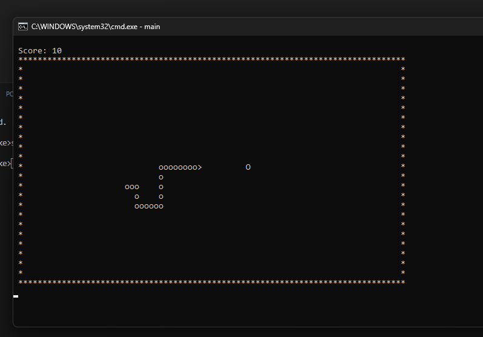

# Snake Game

A simple implementation of the classic Snake game in C.

## Description

This Snake game is implemented using the C programming language and basic console graphics. The player controls a snake that moves around the grid, eating food to grow in length and score points. The snake can able to pass through the walls

## Features

- Arrow keys to control snake movement ((w)Up, (s)Down, (a)Left, ()Right)
- Score tracking
- Snake length increase with each food eaten

## Screenshots

